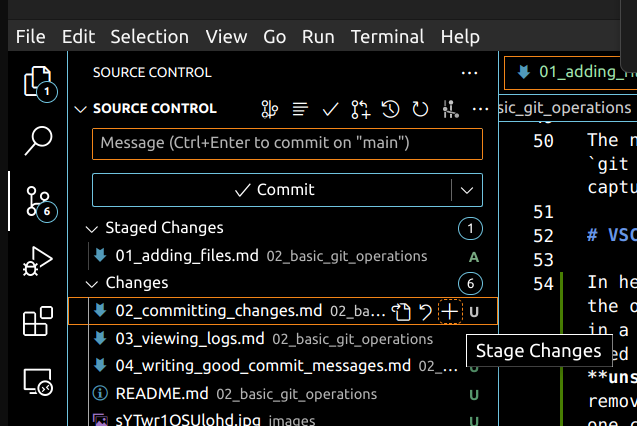
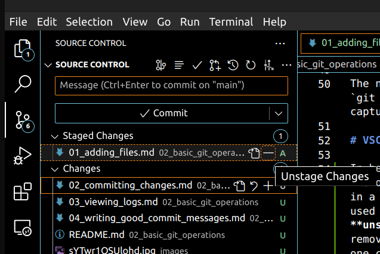
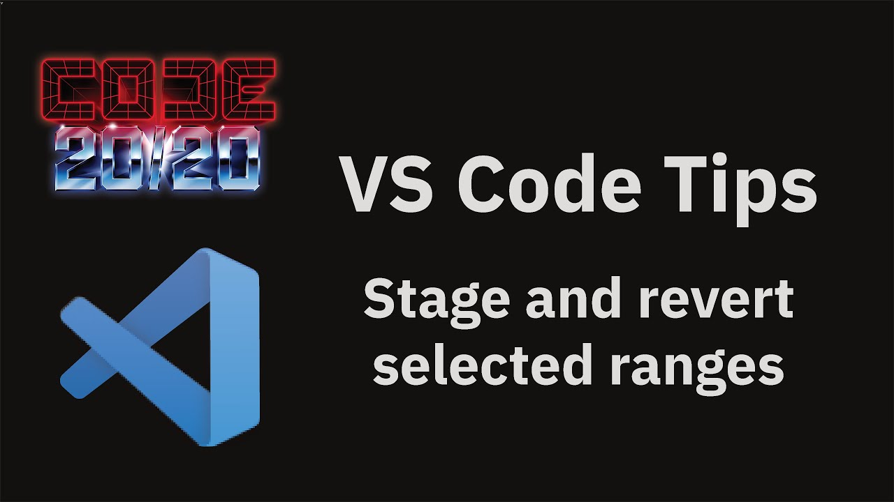

# Adding and removing files 📁

Git enables you to choose specifically which files you want to add or remove from your next snapshot. This section provides you a thorough guide on how to select or unselect files for staging. 

## Understanding Staging Area 🎭

Before diving into adding and removing files, we need to understand the concept of the **staging area**. It is the place where Git holds the changes pending commit —commits are the snapshots, as we will see in the next section. Files in the staging area are not yet recorded in the version history but are poised to be included in the next snapshot. 

## `git add` : Adding Files to the Staging Area 

So, how do we populate the staging area? The basic command that does this is the `git add` command. Use it to add new or modified files to the staging area, marking them for inclusion in your next commit.

There are various `git add` options like:

- `git add .` : Add all new and modified files to the staging area.
- `git add -A` : Stage all changes (additions, modifications, deletions).
- `git add <file>` : Add a specific file to the staging area.
- `git add <directory>` : Add all files under a specific directory.

Even thougt it seems that you will save everything everytime you change something, this is definitively not the case! Think about files containing sensitive information like passwords, keys, personal data, etc. Furthermore, you don't want to save information about your virtual environments, or special configurations like .vscode folders that are created automatically by VSCode to save your preferences.

> Note: There is an alternative solution to not staging this changes that we will discuss in [section 3](../03_git_branches/). 

## Removing Files from Staging Area

The first option would be to use the `git rm` command. 
> &#x26a0;&#xfe0f; Note that not only does it removes files from the staging area, but also deletes them from your **working directory** . 

There are different `git rm` options like:

- `git rm <file>` : Remove a specific file.
- `git rm -r <directory>` : Remove a directory and its contents.

Even though this command is particularly useful for removing files that we created as small tests before a final version and we accidentally stages, it still seems a little bit overkill for most common scenarios. 

You may wonder "Can I remove something from stage without deleiting it from my workspace?" The answer: Yes, there is an alternative! If you want to remove a file from the staging area (unstage it) but not delete it from your working directory, you can use

- `git reset <file>` : it will remove the file from the staging area, leaving it in your working directory. 
- `git reset --hard` : this will discard changes in your working directory and index, reverting to the last commit.

> &#x26a0;&#xfe0f; Careful when using the `--hard` flag, since it will delete _all your current changes_.

## Staging Modified Files ✏️

Explore how to handle modified files, learning how to stage changes and unstage them if needed. We will [later](03_viewing_logs.md) teach you how to view the differences before committing.

By mastering file staging, you set the foundation for effective version control, ensuring your commits are organized, clear, and meaningful. 

The next section will delve deeper into the `git commit` command, providing insights into capturing your project’s progress effectively.

# VSCode or how to make your life easier

In here, we will teach you how VSCode performs the operations that we have shown you here, but in a much easier way. In VSCode you will get used to the nomenclature **stage** and **unstage**. It is extremely easy to add and remove files from the staging area. In fact, one click is enough. Going to the source control panel on the left, you will find that these two operations appear with a + and - symbol respectively.

> Stage changes on the plus symbol

> Unstage changes on the minus symbol

Furthermore, it also allows to check the difference of your code with the already commited version by just clicking on the file. But this is not everything! The next video explains how VSCode even allows to stage and unstage parts of your code and leave some others out. 

[Link to video](https://www.youtube.com/watch?v=sYTwr1OSUlo)