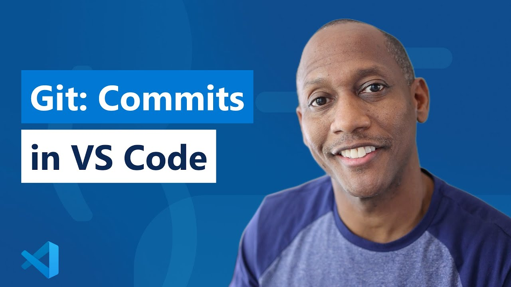

# Taking Snapshots 📸

The essence of Git is taking snapshots of your project **at meaningful intervals** —[section 4](04_writing_good_commit_messages.md) contains the details refering to these and other best practises. 

Enough talking about "snapshots", the technical appropriate word for these is commits. A commit consists on saving all staged changes at once under a descriptive message. Staged changes are not recorded yet by Git, they just live on a special place until they go into a commit. It is this action that makes the changes go into the history, so the `git commit` command is the most basic saving operation Git has. 

Mastering the art and science of committing changes, understanding the significance of each snapshot, and familiarizing yourself with good commit habits are quintessencial to building a robust project history. And this is of upmost importance since these will become your navigation logs of the project’s timeline. 🛤️

## Exploring `git commit`  🧐

Now that you've been introduced to the concept of commits as snapshots in your project's timeline, let’s unearth more secrets of the `git commit` command, ensuring each commit is meaningful and reflective of your progress —see [section 4](04_writing_good_commit_messages.md) for crafting impeccable commit messages.

As we have seen, Git allows you to selectively add changes to a commit, ensuring each snapshot is purposeful and manageable. 

- `git commit -m "Your commit message goes here"`

### Amending Commits ✒️

Mistakes happen! With Git, you can amend your last commit with the `--amend` flag. This will  let you correct the commit message or add forgotten changes, ensuring your history remains clean.

- `git commit --amend`

## VSCode

Now, you are ready to explore VSCode's commit capabilities. In the following video you will find a nice introduction to the 

[Link to video](https://www.youtube.com/watch?v=E6ADS2k8oNQ)

The next step is for you to learn to traverse your project’s timeline with ease and insight. Good luck! 🌌