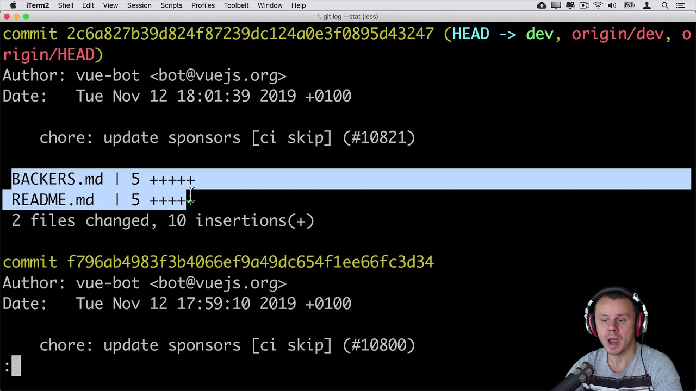

# Viewing the History 🕰️

Dive into the world of logs to view the history of your snapshots. Understand the usage of git log and other related commands to explore the timeline of your project. Learn how to interpret commit information, find specific changes, and grasp the evolution of your project. Familiarize yourself with the tools and techniques to effectively and conveniently navigate your project history. Your project’s past is a click away, make the most of it! 🗺️

## `git diff` : reviewing changes in your codebase
Following the ideas in the [first section of this module](01_adding_files.md), we introduce
the `git diff` command. It is one of the most essential and versatile tools in a developer's toolkit when using Git. It allows you to view the differences between commits, branches, and the working directory and staging area. Understanding how to use git diff effectively can provide valuable insights into the changes in your project and help you manage those changes more effectively.

- `git diff` : it will show you the changes in your working directory that have not yet been staged.
- `git diff --cached` or `git diff --staged` : both commands will show the differences between the staging area and the latest commit
- `git diff branch1..branch2` : will compare branch1 with branch2.
- `git diff commit1..commit2` : this command will show you the differences between the two specified commits.
- `git diff -w` : Ignore whitespace changes.
- `git diff --name-only` : Show only the names of the changed files.
- `git diff --stat` : Show the changes as statistics (how many lines were added or removed).

The git diff command is a powerful tool for reviewing changes in your codebase, understanding the history of your project, and ensuring that you are making and committing changes as expected. 

## `git log` : exploring its historical layers with Git

The `git log` command is a powerful tool that unveils the log of commits, helping you trace the evolution of your codebase. It allows you yo navigate through the history of your project effortlessly.

- `git log --oneline` : Get a concise view of commits.
- `git log --graph` : Visualize the commit tree.
- `git log -p` : See the patch introduced by each commit.

Filtering the history:

- `git log --since`, `git log --until` : Filter commits based on date.
- `git log --author` : Filter commits by author.

Tracing changes to specific files:

- `git log <filename>` : View the commit history for a specific file.
- `git log -- <filename>` : Trace changes to a particular file over time.

## Visual aid

Since these commands are hard to imagine, the best way is to add some visual aid to understand the power of these commands. The first one is a really nice explannation on the `git diff` command, you will find what the output means, how to read it and some other options.

[Link to video](https://www.youtube.com/watch?v=vXN50AmJjgY)

The following video explores some of the options we have discussed on the `git log` command.

[Link to video](https://www.youtube.com/watch?v=8yjCjakdGQs)

## VSCode is still your friend

Remember [Git Gaph](../01_getting_started_with_git/03_VSCode.md)? In here it is where it will shine! Log visualization is one of the most important tools to master, specially at the beginning of the journey. It can help you identify if what you did was indeed what you were expecting to do, but also understand if you are following best practises. It is also interactive, so you can perform operations with this extension directly while visualizing the history tree.

[Link to video](https://www.youtube.com/watch?v=u9ZQpKGTog4)