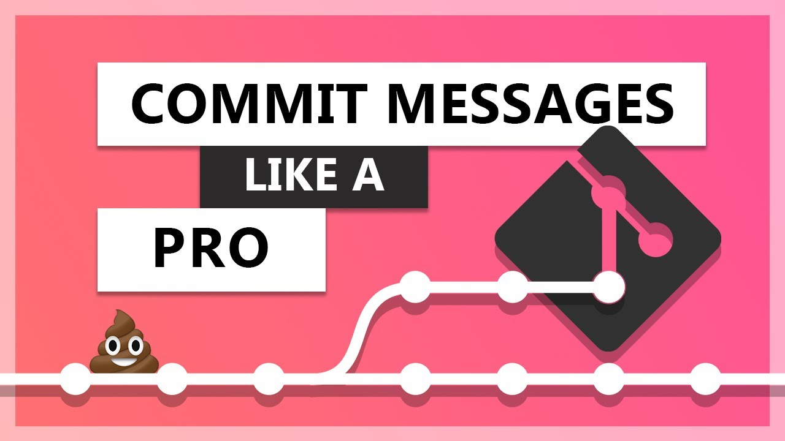
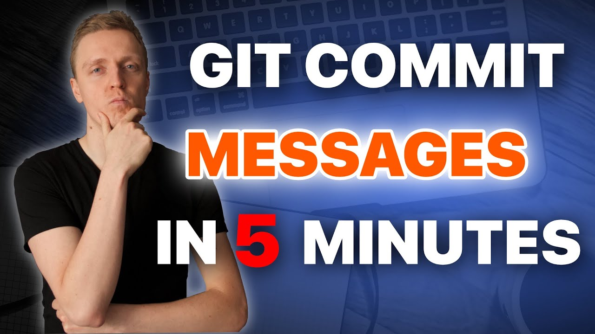

# Best Practices 🌟

As always, whenever we give you best practises, these constitute general guidelines that we believe will help you develop clean code. These are not hyperstrict, but they have a clear purpose and have proven to be effective in keeping a consistent clean history. 

Hence, this section will teach you how to write effective and meaningful commit messages that communicate the context and purpose of each snapshot. Not only how, but also understand when to commit, ensuring each snapshot is meaningful and beneficial for you and your team. Elevate your version control experience and contribute positively to your project's success. 🚀

## The Significance of Commit Messages 📝

In the world of software development, the importance of clear, detailed, and organized commit messages cannot be overstressed. Writing effective commit messages is crucial for future-proofing projects, easing collaboration, and assisting both yourself and colleagues in understanding the history and changes in your code. To create an informative commit message, follow these guidelines:

#### 1. Be Clear and Concise:

A good commit message should precisely summarize the changes made, avoiding generic or vague statements.

#### 2. Organize Commits Logically:

For larger features or multiple issue fixes, break your changes into smaller, logical commits. Each should represent a self-contained unit of work.

#### 3. Use Imperative Verbs:

Commit messages should be written in the imperative mood, beginning with verbs like “Add,” “Fix,” or “Update,” to clearly convey the commit’s purpose.

#### 4. Summarize with a Subject Line:

Initiate your commit message with a brief subject line that encapsulates the main purpose of the commit. Keep it around 50 characters for optimal visibility in various logs.

#### 5. Follow a Template or Use a consistent commit message structure:

Establishing a commit message template helps in maintaining consistency and structure in messages across your team or project. For example, you could follow [Conventional Commits](https://www.conventionalcommits.org/en/v1.0.0/) and categorize commits into types like:
- **feat** (new feature)
- **fix** (bug fix)
- **chore** (minor changes that don’t modify source or test files)
- **docs** changes to the documentation like README.md
- **style** or **refactor** style or formatting changes
- **perf** improves code performance
- **etc.**
- **Create your own categories!**

This categorization aids in providing clarity and ensuring that the commit history remains informative and readable. Including an optional commit body and footer, to further elaborate on the commit, is also beneficial.

> Note: when using something like github or some visualization that allows for unicode, HTML entities or UTF-8 encoding, you can use emojis at the beginning of every commit title to make this categorization even easier to locate. This tip works wonders when visualizing history trees, since the different types of commits get organised under their corresponding symbol. For example, :bug: for bugs, :package: for packages or modules, :ok_hand: for improvements, :pen: or :paintbrush: for styling improvements, or :pinched_fingers: for Italian stuff. Just choose your team nomenclature and go for it.

#### 6. Update Commit Messages Properly:

Utilize Git's `git commit --amend` option to update a commit message, maintaining a tidy and organized commit history.

### Video summaries

Since this is one of the most important topics in this module, we have included two extra videos for you to check where these practises get futher explain and with some extra details.

[Link to video](https://www.youtube.com/watch?v=OJqUWvmf4gg)

[Link to video](https://www.youtube.com/watch?v=_gpNPNMYbVY)

## Conclusions

In essence, when drafting commit messages, ponder over why and what of the changes. Assuring well-written commit messages is a step towards efficient code management and productive collaboration within your development team.

Remember, every time you write a commit message, you're aiding future understanding and troubleshooting, making it an investment in the project's long-term health and usability, which, and I cannot stress this more... **SAVES MONEY!**