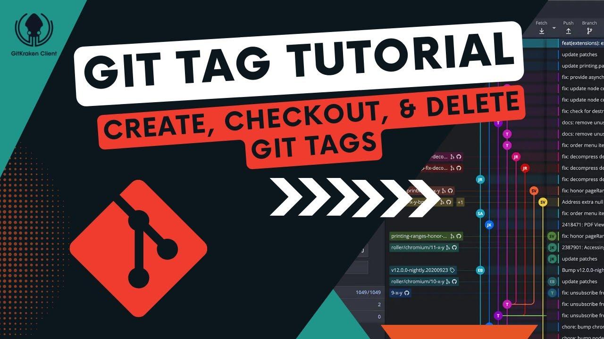

## `git tag` : marking milestones 🏷️

The `git tag` command is your way to mark significant points in your project's history, like releases or major updates. This tool not only helps you create lightweight and annotated tags but also manages them efficiently.

In Git, lightweight tags are simple pointers to specific commits. They're akin to a bookmark, marking a specific point in the repository's history without containing any additional information or metadata. On the other hand, annotated tags are stored as full objects in the Git database. They include the tagger’s name, email, the date of the tagging, and have a tagging message, providing context about the tag's purpose. Annotated tags can also be signed and verified with GNU Privacy Guard (GPG), making them particularly useful for release management by adding a layer of security and authenticity to the tag.

- `git tag` : list all tags in the repository.
- `git tag <tag_name>` : create a new lightweight tag named `<tag_name>`.
- `git tag -a <tag_name> -m "<message>"` : create an annotated tag, using `<message>` to describe this tag.
- `git tag -d <tag_name>` : delete the tag named `<tag_name>`.
- `git tag -l "<pattern>"` : list tags that match the given pattern.
- `git tag -v <tag_name>` : verify the tag. This is useful for signed tags to check the signature.
- `git tag -f <tag_name>` : move an existing tag `<tag_name>` to the current commit. Use with caution as it affects others' clones.
- `git show <tag_name>` : show the commit and metadata that a tag points to.

## `git push` : sharing your marks 🚀

The `git push` command enables you to share tags with others, making sure your marked milestones are available to all collaborators and maintain the project's historical milestones intact.

- `git push origin <tag_name>` : push the specified tag to the remote repository.
- `git push origin --tags` : push all local tags to the remote repository.
- `git push --delete origin <tag_name>` : delete a tag from the remote repository.
- `git push origin :refs/tags/<tag_name>` : another way to delete a tag from the remote repository.

With these commands, you can effectively manage and communicate the evolution of your project through tags, enhancing collaboration and clarity within your team.

[Link to video](https://www.youtube.com/watch?v=spkUevg1NqM)

