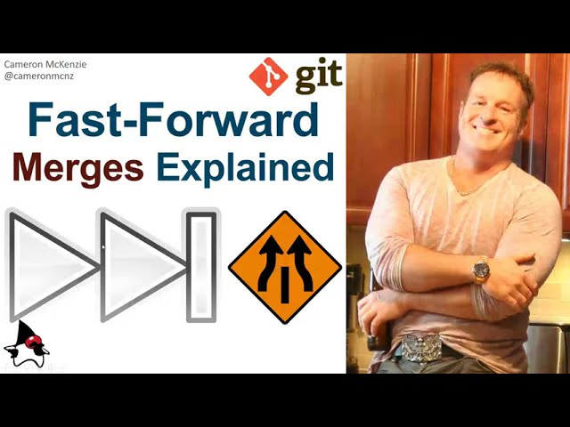

# Merging Branches (`git merge`) 🔄

Welcome to the chapter where we make sense of collaboration by integrating diverse strands of work. Merging is the process where you combine the contents of different branches to forge a single unified history. In this section, we'll explore how to merge branches, encompassing both the command line methods and the visual tools that make merging less daunting.
Merging Branches 🔄

## The Merge Commit: A Knot Tying Branches Together 🎀

The merge commit is a special type of commit that ties the histories of the merged branches together, creating a single point where different development paths converge.

### What is a Merge Commit and why is it different than a regular commit?

A merge commit is a special type of commit that has **two** parent commits. Whenever you merge one branch into another, Git creates a new commit that has pointers to both the merged branch's last commit and the current branch's last commit. They are easily recognizable on Git because those are the points where two lines of development came together.

## How to Create a Merge Commit?

Creating a merge commit is a straightforward process in Git, usually accomplished with a simple `merge` command. However, it has some subtleties one needs to mention. In order to perform a merge, you should be in the branch you want to **receive the changes into** and then merge the changes **from an different** branch. Of course, doing the inverse procedure leads to identical result. The difference being what branch you want to keep on working on. The following simplistic scenario gives a general idea

- `git checkout branch_to_merge_into` : switch to the branch that will receive the merge.
- `git merge branch_to_merge_from` : merge the specified branch into the current branch.

## `git merge` : Weaving Branches Together 🧶

`git merge` is your primary command for integrating changes from one branch into another. It combines the end points of both branches, bringing them together.

- `git merge <branch>` : Merge the specified branch into your current branch, creating a merge commit if there are no conflicts.
- `git merge --no-ff <branch>` : Create a merge commit even if the merge resolves as a fast-forward.
- `git merge --squash <branch>` : Combine all changes into a single commit without creating a merge commit.
- `git merge --abort` : If there are merge conflicts, you can abort the merge to reset your branch to the state before the merge attempt.

You will learn much more about squashing on the [best practises section](04_keeping_linear_history.md).

In the following video you will understand what a fast-forward merge and what the `--no-ff` flag does.

[Link to video](https://www.youtube.com/watch?v=36ueMx5hro8)
