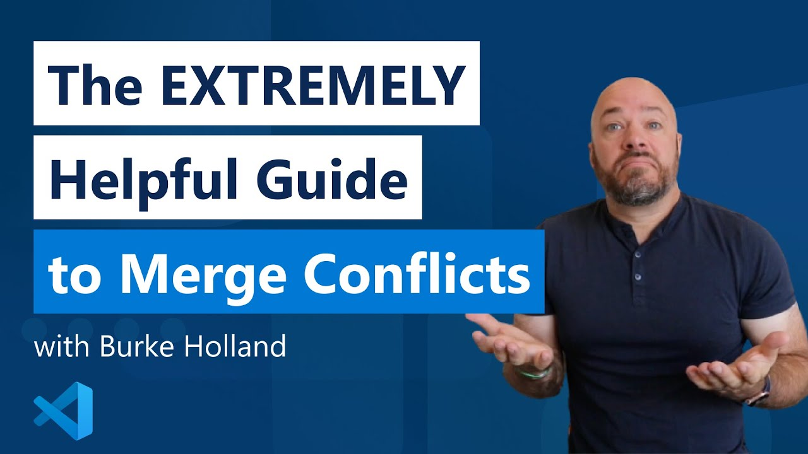

# Handling Merge Conflicts 🚧

Merge conflicts can be intimidating, but they're just a natural part of collaboration. Learn how to identify and resolve them.

## What is a Merge Conflict?

A merge conflict occurs when Git can’t automatically reconcile differences in code between two commits. Conflicts are a natural part of the development process when multiple people are editing the same parts of the same files.

## Resolving Conflicts:

When Git cannot automatically merge changes, it's time for you to step in and decide which code should prevail. Here is how the workflow normally goes:

### Step 1: Detecting the Conflict

When you attempt to merge two branches with `git merge` and Git cannot automatically resolve differences in code, it will stop right before the merge commit and output a message indicating which files have conflicts.

Before you dive into resolving the conflict, you need to understand why it occurred. Conflicts often happen when two branches have changed the same part of the same file. Git will mark the file as conflicted and halt the merging process, allowing you to resolve it manually.

### Step 2: Examining the Conflicted File

Open the conflicted file(s) in your text editor or IDE. Git will have inserted markers that delineate the conflicting changes:

    <<<<<<< HEAD
    your changes
    =======
    changes from the branch you're trying to merge
    >>>>>>> branch-name

- The section marked by <<<<<<< HEAD is your version of the code.
- The ======= divider separates your changes from the incoming changes.
- The section after the divider until >>>>>>> branch-name is the code from the branch you're trying to merge.

### Step 3: Resolving the Conflict

Now, it’s your responsibility to choose which code to keep. You may choose one side, combine elements of both, or write something new entirely. After editing the file, it should look exactly how you want the final version to be—without the Git markers.

After you’ve made your changes, save the file. Then, you can stage and commit the changes before retrying the merge again. 

## Solving Merge Conflicts on VSCode

VSCode offers an amazing interface to resolve conflicts. It makes the process so much easier than going to the branches oneselve and allows you to understand both structures in a global context. Here you have a wonderful explannation by the VSCode gang

[Link to video](https://www.youtube.com/watch?v=HosPml1qkrg)