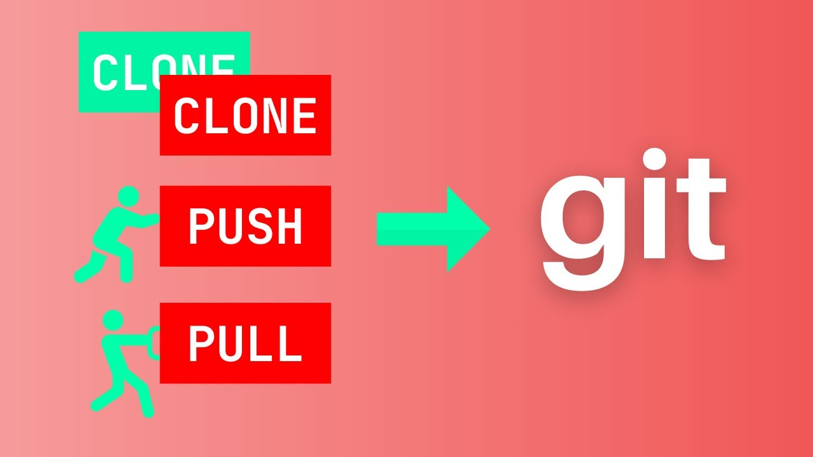

# Synchronizing Changes: Pushing and Pulling from Remote (`git push`, `git pull`) 🔄

When working with Git in a collaborative environment, you'll often need to synchronize your work with a remote repository. This can happen, for example, whenever some colleague makes some changes to a branch in which you are working in. This is where `git push` and `git pull` come into play, acting as the conduits for remote collaboration. In this section, we'll explore these commands and how they enable you to share your contributions and stay up-to-date with others'.
## `git push`: Sharing Your Contributions 📤

`git push` updates the remote repository with your local commits. It is the command that sends your latest changes to the remote server, allowing your team to see the progress you've made.

Here are some common usages of the git push command:

- `git push origin <branch>`: Pushes your specified branch to the remote named origin.
- `git push --all`: Pushes all your local branches to the corresponding remote branches.
- `git push origin --delete <branch>`: Deletes a remote branch.
- `git push --tags`: Pushes your tags to the remote repository.

## `git pull`: Receiving Updates 📥

Conversely, `git pull` fetches changes from the remote repository and merges them into your local branch. It keeps you in sync with the collective progress of your team's project.

Here’s how you can use the git pull command effectively:

- `git pull origin <branch>`: Fetches the specified branch from the remote named origin and merges it into your current branch.
- `git pull --rebase`: Fetches changes and rebases your local changes on top of the retrieved commits.
- `git pull --no-commit`: Fetches the changes but does not create a merge commit.

[Link to video](https://www.youtube.com/watch?v=yxvqLBHZfXk)
