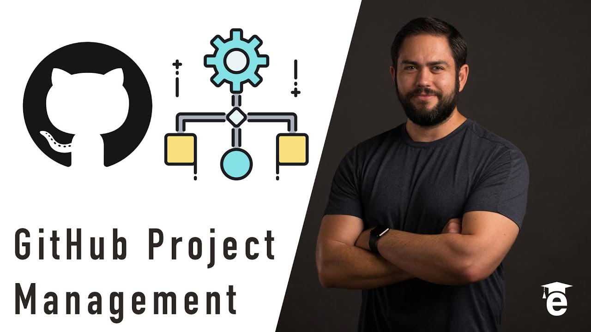

# Managing Projects and Tracking Issues with GitHub and GitLab 📊

GitHub Projects and GitLab's Issue Tracking and Boards are embedded tools that can help you manage your projects. These tools help organize tasks, collaborate more efficiently, and keep your projects on track, although compare to other providers, they are famously limited. It all depends on the scope of your project and the size of your organization.

## GitHub Projects

GitHub Projects provides a highly flexible interface designed to manage workflows, track tasks, and foster collaboration within teams. By utilizing GitHub Projects, you can effectively categorize work, automate processes, and directly integrate with GitHub's Issues and Pull Requests.

- **Creating a Project Board**: Set up a new project board directly from your repository, organization, or user profile. This feature allows you to organize and monitor tasks efficiently, giving you visibility over the project's entire lifecycle.
- **Columns and Cards**: Utilize customizable columns like "Todo", "In Progress", and "Done" to structure your workflow. You can drag and drop cards through these columns as tasks evolve from initiation to completion, offering a clear visual progression of each task.
- **Automations**: Streamline your workflow by setting up automations that trigger card movements when certain events occur, such as merging a pull request or closing an issue. This reduces manual oversight and ensures that project status is updated in real time.

GitHub's Issues are integral to managing and tracking individual tasks within a project. They provide a way to discuss and resolve project-related problems, making them essential for detailed task management:

- **Integration with Project Boards**: Link issues directly to specific cards on your project board for a seamless transition from task creation to completion. This integration helps in tracking the progress of issues without switching contexts.
- **Using Labels and Milestones**: Organize issues using labels to categorize them by priority, type, or any other classification that suits your workflow. Additionally, milestones can be used to group issues under specific targets or phases of the project.
- **Assignment and Notifications**: Assign issues to specific team members and configure notifications to keep everyone informed about changes and updates. This ensures that team members are always aware of their responsibilities and the current status of tasks.

Example of using a Project Board with GitHub Issues:

1. Navigate to the "Projects" tab in your GitHub repository.
2. Click "New project", choose a template, or start with a custom board.
3. Add columns like "Todo", "In Review", and "Done", and populate them with cards linked to issues or pull requests.
4. Set up automations to move cards as issues are opened, updated, or closed, ensuring that the board reflects the real-time status of the project.

This enhanced management capability in GitHub Projects, combined with the detailed tracking provided by GitHub Issues, creates a robust environment for managing both small and large-scale projects efficiently.

[Link to video](https://www.youtube.com/watch?v=YVFa5VljCDY)

## GitLab Issue Tracking and Boards: Enhanced Project Visibility

GitLab enhances project management through its integrated Issue Tracking system and Kanban and Scrum boards. These features facilitate better planning, tracking, and execution of project tasks within a single application.

- **Issues**: Create and manage issues to track ideas, enhancements, tasks, or bugs. Customize issue labels for categorization and prioritization.
- **Milestones**: Group issues into milestones to track progress on project phases or release cycles.
- **GitLab Boards**: Visualize and manage your issues with Kanban or Scrum boards tailored to your workflow needs.

Setting up a GitLab Board:

1. From your GitLab project, go to the "Issues" then "Boards".
2. Create a new board and configure it with lists based on issue labels or milestones.
3. Drag and drop issues between lists to reflect their current status and manage the workflow dynamically.

### Insights and Reporting

Track the health and progress of your projects through detailed insights and reporting tools offered by both platforms:

- **GitHub Insights**: Access insights into project activity, such as recently merged pull requests or closed issues, directly from the "Insights" tab.
- **GitLab Value Stream Analytics**: Monitor the efficiency and status of your workflows to optimize the process and reduce time to delivery.

By utilizing GitHub Projects and GitLab Issue Tracking and Boards, you can enhance collaboration, streamline project workflows, and maintain a high level of organization within your development teams. Dive into these tools to transform how your projects are managed and executed, ensuring transparency, efficiency, and productivity across your projects. 🚀🔧