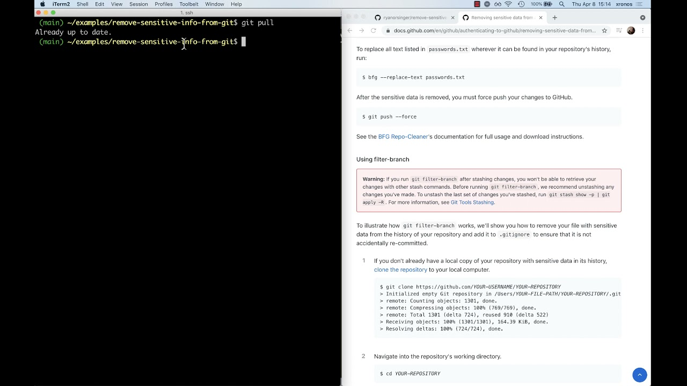

# Erasing Sensitive Information from Git History 🚫🔒

In this section, we'll explore the powerful tool `git filter-repo` to erase sensitive data from your Git history. This is crucial for maintaining security and privacy in your projects.

## Introduction to `git filter-repo`

`git filter-repo` is a versatile tool for rewriting history, designed to replace the older `git filter-branch`. Before diving into the process, it's important to ensure that you have no stashed changes, as these might be lost. Unstash any changes with the command `git stash show -p | git apply -R`.

## Setting up `git filter-repo`

First, install the `git filter-repo` tool. You can install it manually or use a package manager like HomeBrew:

```bash
brew install git-filter-repo
```

Refer to INSTALL.md in the newren/git-filter-repo repository for more details.

## Preparing Your Repository

Clone your repository if you haven't done so:

```bash
git clone https://github.com/YOUR-USERNAME/YOUR-REPOSITORY
```

Navigate to the repository directory:

```bash
cd YOUR-REPOSITORY
```

## Removing Sensitive Data

Run `git filter-repo` with the necessary arguments to remove a file containing sensitive data:

```bash
git filter-repo --invert-paths --path PATH-TO-YOUR-FILE-WITH-SENSITIVE-DATA
```

This command will:

- Process the entire history of each branch and tag without checking out the data.
- Remove the specified file and any empty commits created as a result.
- Overwrite existing tags.

## Prevent Future Commits of Sensitive Data

Add the file to `.gitignore` to avoid recommitting it:

```bash
echo "YOUR-FILE-WITH-SENSITIVE-DATA" >> .gitignore
git add .gitignore
git commit -m "Add YOUR-FILE-WITH-SENSITIVE-DATA to .gitignore"
```

## Finalizing Changes

Check all your branches to ensure the sensitive file is removed, then push the changes:

```bash
git push origin --force --all
git push origin --force --tags
```

## Contact GitHub Support

After updating your history on GitHub, contact GitHub Support to remove cached views and references to the sensitive data. This step is crucial as GitHub will not automatically remove cached data unless requested.




[Link to video](https://www.youtube.com/watch?v=liCAFV8Rmbs)


And in case this sensitive information are in some other Github subsystem, like PRs or other similar, you should get in contact with Github support, [here](https://docs.github.com/en/authentication/keeping-your-account-and-data-secure/removing-sensitive-data-from-a-repository) you have the oficial Github guide.